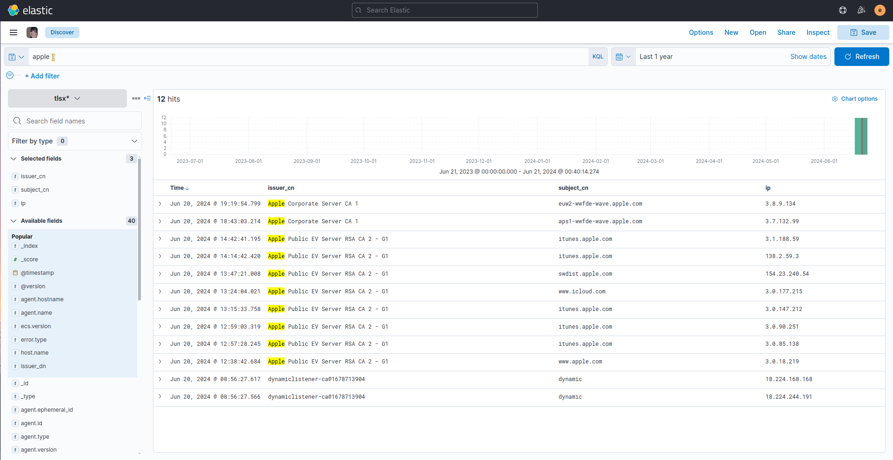

# subdomain-monitoring-elasticsearch


### Configurations
```
wget -qO - https://artifacts.elastic.co/GPG-KEY-elasticsearch | sudo apt-key add -
sudo sh -c 'echo "deb https://artifacts.elastic.co/packages/7.x/apt stable main" > /etc/apt/sources.list.d/elastic-7.x.list'
sudo apt-get update
sudo apt install logstash
sudo apt install filebeat
sudo apt-get install elasticsearch
sudo systemctl start elasticsearch
sudo systemctl enable elasticsearch
```
### Example
***certstream***
- install certstream
`pip install certstream`
```bash
sudo /usr/share/logstash/bin/logstash -f certstream/certstream.conf
certstream --full --json | sudo filebeat -c certstream/certstream.yml -e

OR

sudo websocat -t - autoreconnect:wss://certstream.calidog.io  | sudo filebeat -c certstream/certstream.yml -e
```


***Tlsx***
- install tlsx and uncover
```bash
go install github.com/projectdiscovery/tlsx/cmd/tlsx@latest
go install -v github.com/projectdiscovery/uncover/cmd/uncover@latest
```
Downloads File IPs Ranges `https://github.com/lord-alfred/ipranges`
```bash
sudo /usr/share/logstash/bin/logstash -f tlsx/tlsx.conf
cat ipv4.txt | uncover -silent | tlsx -json -silent -cn -nc -l | sudo filebeat -c tlsx/tlsx.yml -e
```

