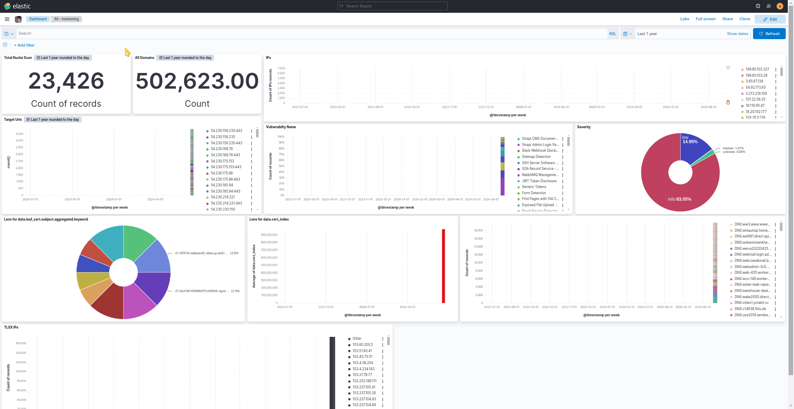
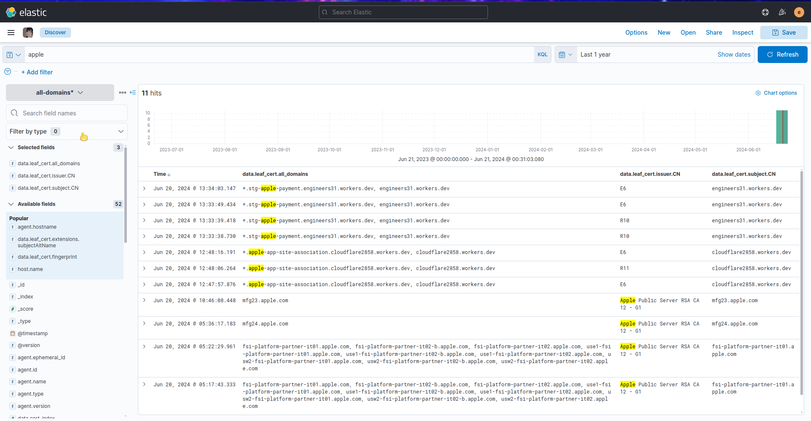
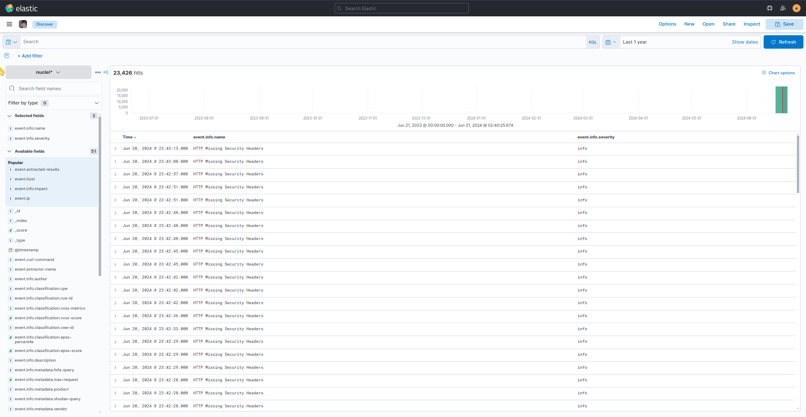

# subdomain-monitoring-elasticsearch



### Configurations
```
wget -qO - https://artifacts.elastic.co/GPG-KEY-elasticsearch | sudo apt-key add -
sudo sh -c 'echo "deb https://artifacts.elastic.co/packages/7.x/apt stable main" > /etc/apt/sources.list.d/elastic-7.x.list'
sudo apt-get update
sudo apt install logstash
sudo apt install filebeat
sudo apt-get install elasticsearch
sudo systemctl start elasticsearch
sudo systemctl enable elasticsearch
```

***Reset Password elasticsearch***
- Edit File: `/etc/elasticsearch/elasticsearch.yml` and added this line `xpack.security.enabled: true`
- run command: `./usr/share/elasticsearch/bin/elasticsearch-setup-passwords interactive`
- Edit file `certstream.conf` and `tlsx.conf` Replace IP elasticsearch and user/password `[Default User: elastic]`.

### Example
***certstream***
- install certstream
`pip install certstream`
```bash
sudo /usr/share/logstash/bin/logstash -f certstream/certstream.conf
certstream --full --json | sudo filebeat -c certstream/certstream.yml -e

OR

sudo websocat -t - autoreconnect:wss://certstream.calidog.io  | sudo filebeat -c certstream/certstream.yml -e
```


***Tlsx***
- install tlsx and uncover
```bash
go install github.com/projectdiscovery/tlsx/cmd/tlsx@latest
go install -v github.com/projectdiscovery/uncover/cmd/uncover@latest
go install -v github.com/projectdiscovery/mapcidr/cmd/mapcidr@latest
```
Downloads File IPs Ranges `https://github.com/lord-alfred/ipranges`
```bash
sudo /usr/share/logstash/bin/logstash -f tlsx/tlsx.conf
cat ipv4.txt | mapcidr -silent | tlsx -json -silent -cn -nc -l | sudo filebeat -c tlsx/tlsx.yml -e

OR

uncover -silent -e 'ssl:"*.tesla.com"' -f ip | tlsx -json -silent -cn -nc -l | sudo filebeat -c tlsx/tlsx.yml -e

loop
#!/bin/bash

# Fetch the list of domains and save it to a file
curl -s "https://raw.githubusercontent.com/arkadiyt/bounty-targets-data/main/data/domains.txt" > domains.txt

# Read the file line by line
while IFS= read -r domain; do
  # Use uncover tool on each domain
  uncover -q "ssl:\"$domain\"" -silent -f ip | tlsx -json -silent -cn -nc -l | sudo filebeat -c tlsx/tlsx.yml -e
done < domains.txt

# Clean up
rm domains.txt
```


***Nuclei Report In elasticsearch***
- Nuclei Report [https://docs.projectdiscovery.io/tools/nuclei/running](https://docs.projectdiscovery.io/tools/nuclei/running#nuclei-reporting)
```yaml
elasticsearch:
  host: ""
  ip: ""
  port: 9200
  ssl: false
  ssl-verification: false
  username: ""
  password: ""
  index-name: "nuclei-scanner"
```

